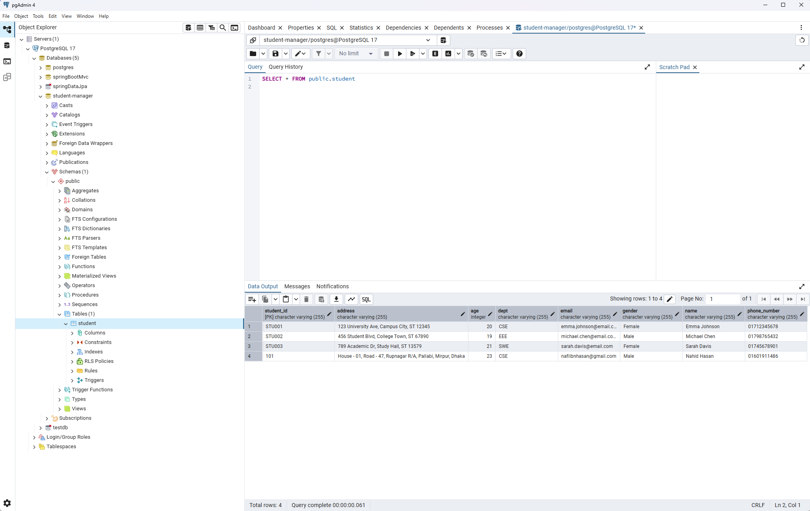

# Student Manager - Using Spring Boot MVC, Thymeleaf, and PostgreSQL

A modern, responsive Spring Boot & Thymeleaf web app for managing student records. This project uses PostgreSQL as the primary database, integrated via Spring Data JPA for object-relational mapping.
Built as a practice project to reinforce my learning of Spring Boot MVC and Thymeleaf. 


## ✨ Features

- **Add Student:** Register new students with details like ID, name, email, age, gender, department, phone number, and address.
- **Validation:**  A user having id or email that already exists in the database can not be added. Age must be 18 or above.
- **View All Students:** See a dynamic, card-based list of all students with their info.
- **Success Page:** After adding a student, see a confirmation with next-step actions.
- **Responsive Design:** Works great on desktop and mobile.
- **Modern UI:** Gradient headers, clean cards, and interactive navigation.


## 📂 Project Structure

```
student-manager/
├── src/
│   ├── main/
│   │   ├── java/com/nahid/studentmanager/
│   │   │   ├── controller/         # Spring MVC controllers
│   │   │   ├── model/              # Student model class
│   │   │   ├── service/            # Service for managing students
│   │   │   └── StudentManagerApplication.java
│   │   └── resources/
│   │       ├── static/             # CSS and static assets
│   │       └── templates/          # Thymeleaf HTML templates
│   └── test/
├── build.gradle
└── README.md
```


## 📸 Screenshots


[//]: # (> *&#40;Will add screenshots soon...&#41;*)

> - **Homepage:**  
  

> - **Add Student Page:**  
  

> - **Success Page:**  
    

> - **All Students Page:**  
  

> - **Database Records:**  
  

    

## 🛠️ Technologies Used

- **Java 21**
- **Spring Boot MVC**
- **Spring Data JPA**
- **Spring Boot I/O Validation**
- **PostgreSQL**
- **Thymeleaf**
- **Lombok**
- **Gradle**
- **HTML**
- **CSS**
- **FontAwesome Icons**


